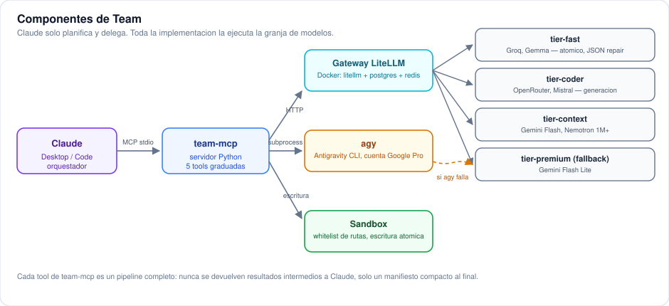
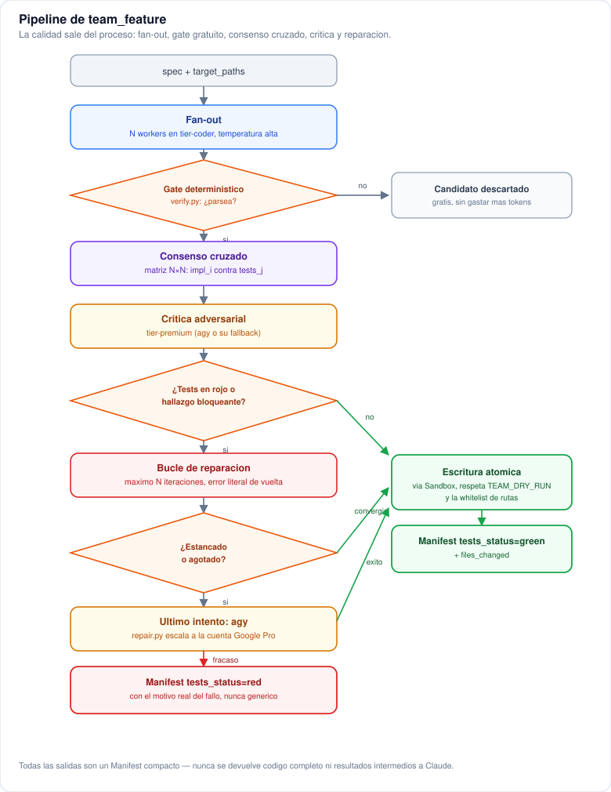

<p align="center">
  
</p>

<h1 align="center">Team</h1>

<p align="center">
  An MCP server that lets Claude delegate real implementation work to a farm of free/cheap LLMs.
</p>

<p align="center">
  <a href="https://github.com/Ki-re/Team/actions/workflows/tests.yml"></a>
  <a href="LICENSE"></a>
  
</p>

Claude (Desktop or Code) acts **only** as the orchestrator: it plans and
delegates. All the actual implementation — writing code, analyzing logs,
reviewing changes — runs on a farm of free or cheap models behind a
self-hosted LiteLLM gateway, through this local MCP server.

The interesting part isn't "connect some cheap models" — small models
produce mediocre code on their own. The value is in the *process* wrapped
around them: N-way generation, deterministic verification, cross-validation
consensus, adversarial critique, and bounded repair loops. Quality comes
from the pipeline, not from any single model.

See [CHANGELOG.md](CHANGELOG.md) for the version history.

## Architecture

Hand-authored SVG diagrams (not Mermaid — it didn't render consistently
everywhere). Diagrams for the other workflows (`team_task`, `team_epic`,
`team_ask`, `team_validate`, `docs_sync`) live in
[docs/DIAGRAMS.md](docs/DIAGRAMS.md).

### Components
How the pieces fit together: Claude only orchestrates, `team-mcp` talks to
the gateway and to an optional coding-agent CLI, and every write goes
through a sandbox.



### The `team_feature` pipeline
Fan-out across N workers, a free deterministic gate, cross-validation
consensus, adversarial critique, and a bounded repair loop with escalation
to the premium tier as a last resort — the project's main unit of work.



## The five tools

Claude only ever sees five entry points, graded by task complexity — each
one is a complete pipeline that returns a compact manifest, never
intermediate results or raw generated code:

| Tool | Use it for | Notes |
|---|---|---|
| `team_task` | A small, unambiguous change to one file | No premium tier. Escalates itself to `team_feature` if the deterministic gate fails twice. |
| `team_feature` | The main workhorse | `kind=new` (default), `refactor` (preserves behavior via generated characterization tests), `fix` (requires a `repro_command` that fails today and must exit 0 after the fix — a real test, not one the model invents), or `review` (critique only, no code generated). |
| `team_epic` | A multi-task plan with dependencies | DAG of nodes, executed in parallel topological waves, with a real token budget and clean cutoff. |
| `team_ask` | Questions about code or logs, read-only | Map-reduce with citation verification (`path:line`); `allow_web_search=True` for current external context. |
| `team_validate` | Final GO/NO-GO verdict | Deterministic checks (syntax, tests, secrets, lint) block first, with no model involved; `selftest=True` audits the health of all four tiers instead. |

Optional documentation sync: pass `update_docs=True` and `kb_path=...` to
`team_feature`/`team_epic` and, after a successful change, a small
sub-agent updates any *existing* files in a markdown knowledge base
(frontmatter + `INDEX.md` — see [docs/KB_CONVENTION.md](docs/KB_CONVENTION.md))
that the change made stale. It never invents new entries on its own.
`team_validate` can also audit a knowledge base directory by itself
(broken frontmatter, dangling links, stale entries) without `update_docs`.

## Quickstart

### Prerequisites

- Python 3.11+
- Docker + Docker Compose, on whatever host will run the gateway (your own
  machine, a small VPS, a home server — anything reachable from where
  Claude runs)
- API keys for at least a couple of free-tier providers (e.g.
  [Groq](https://console.groq.com), [OpenRouter](https://openrouter.ai))
- [Claude Code](https://claude.com/claude-code) or Claude Desktop

### 1. Clone and install

```bash
git clone https://github.com/Ki-re/Team.git
cd Team
python -m venv .venv

# Windows
.venv\Scripts\activate
# macOS / Linux
source .venv/bin/activate

pip install -e ".[dev]"
cp .env.example .env
```

### 2. Deploy the gateway

`deploy/` has everything needed to run LiteLLM + Postgres + Redis in
Docker. Deploy it anywhere reachable from your machine:

```bash
cd deploy
cp .env.example .env   # fill in at least one provider's API key
docker compose up -d
```

First boot takes a few minutes (database migrations + registering the
model list) — that's normal, not a hang; `docker logs -f team-litellm`
shows progress. Add or change API keys later either by editing
`deploy/.env` and redeploying, or live from the web UI at
`http://<gateway-host>:4000/ui` with no restart needed
(`store_model_in_db: true` is already set for this).

`deploy/litellm.config.yaml` ships as a working starting template with
two providers per tier — free-tier model availability shifts often, so
treat the exact model list as a starting point, verify what's actually
live for your own keys, and run `selftest` (below) after any change.

### 3. Configure the MCP server

Edit `.env` in the repo root:

```bash
TEAM_GATEWAY_URL=http://<gateway-host>:4000
TEAM_GATEWAY_KEY=<the master key or a virtual key from deploy/.env>
```

### 4. Register the MCP server with Claude Code

```bash
claude mcp add team --scope user -- "/absolute/path/to/Team/.venv/bin/python" -m team_mcp.server
claude mcp list   # should show "team ... Connected"
```

On Windows, use the `.venv\Scripts\python.exe` interpreter instead. The
path must point at *this repo's* virtual environment (not a bare
`python`) — that's where the `team_mcp` package is installed in editable
mode. `.env` always loads from this repo's root regardless of which
project Claude has open when it invokes the server.

For Claude Desktop, the equivalent manual entry in its JSON config:

```json
{
  "mcpServers": {
    "team": {
      "command": "/absolute/path/to/Team/.venv/bin/python",
      "args": ["-m", "team_mcp.server"]
    }
  }
}
```

### 5. Verify

```bash
curl http://<gateway-host>:4000/health/liveliness
python -m team_mcp.cli run team_validate --selftest
```

`selftest` exercises all four tiers for real and reports which ones are
healthy — the actual source of truth for whether your setup works, not
just whether the gateway process is up.

## Set up with an AI coding agent

If you're already working inside Claude Code (or another coding agent),
you can hand it the whole setup instead of doing it by hand. Paste this:

```text
Set up the "team" MCP server for me from https://github.com/Ki-re/Team:

1. Clone the repo, create a Python 3.11+ virtualenv inside it, and run
   `pip install -e ".[dev]"`.
2. Copy .env.example to .env. Ask me for TEAM_GATEWAY_URL and
   TEAM_GATEWAY_KEY once I've deployed the gateway (step 3) — don't guess
   them.
3. Explain that deploy/ contains a docker-compose.yml for the LiteLLM
   gateway, and ask me where I want to run it (this machine, a remote
   server I have SSH access to, something already running). Help me copy
   deploy/.env.example to deploy/.env and fill in at least one provider
   API key, then run `docker compose up -d` there.
4. Once the gateway is reachable, register this MCP server globally:
   `claude mcp add team --scope user -- <path-to-repo>/.venv/<bin-or-Scripts>/python -m team_mcp.server`
   then confirm with `claude mcp list` that it shows "Connected".
5. Copy skill/SKILL.md from this repo to ~/.claude/skills/team/SKILL.md
   (create the directory if needed) so future sessions discover it
   automatically, and copy skill/CLAUDE.md's contents into my global
   ~/.claude/CLAUDE.md (append, don't overwrite anything already there).
6. Run `python -m team_mcp.cli run team_validate --selftest` and report
   which tiers are healthy.

Ask me for any secret or credential instead of inventing one, and don't
commit .env or deploy/.env anywhere.
```

The referenced `skill/SKILL.md` and `skill/CLAUDE.md` are the same
condensed usage guide Claude Code's own skill system reads — see
[Documentation](#documentation) below for how they fit together.

## Project structure

```
deploy/              docker-compose.yml + litellm.config.yaml for the gateway
skill/                portable skill + CLAUDE.md content for other agents to install
docs/                 diagrams, knowledge-base convention, changelog detail
src/team_mcp/         the MCP server (Python)
  providers/           gateway.py (LiteLLM HTTP) · agy.py (coding-agent CLI) · router.py
  engine/              verify · consensus · critic · repair · schemas · sandbox · ledger · frontmatter
  workflows/           team_task · team_feature · team_epic · team_ask · team_validate · docs_sync
tests/                 pytest suite (deterministic/local logic only — see below)
playground/            scratch files used for manual live verification during development
```

## Testing

```bash
pytest tests/ -q
```

The suite covers deterministic, local logic only — sandbox path
whitelisting, the verification gate, consensus scoring, JSON extraction,
frontmatter parsing, the `team_epic` DAG, `team_validate`'s checks, and so
on. Code paths that call live models (the fan-out itself, critique,
map-reduce) are deliberately not mocked here; they're verified manually
against a real gateway during development, since mocking `httpx` or
spending real API quota on every test run would be the wrong trade-off at
this project's scale.

## Documentation

- [docs/DIAGRAMS.md](docs/DIAGRAMS.md) — diagrams for every workflow.
- [docs/KB_CONVENTION.md](docs/KB_CONVENTION.md) — the markdown
  knowledge-base format `docs_sync` and `team_validate` understand.
- [skill/SKILL.md](skill/SKILL.md) / [skill/CLAUDE.md](skill/CLAUDE.md) —
  the portable usage guide any Claude Code session can install (see the
  agent setup prompt above).
- [CHANGELOG.md](CHANGELOG.md) — version history.

## Contributing

Issues and pull requests are welcome. There's no formal process yet —
open an issue for anything non-trivial before sending a large PR, and
keep the test suite green (`pytest tests/ -q`).

## License

[MIT](LICENSE)
