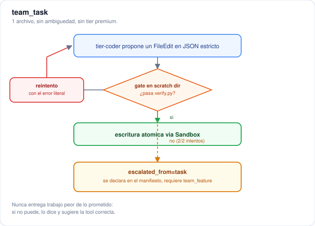
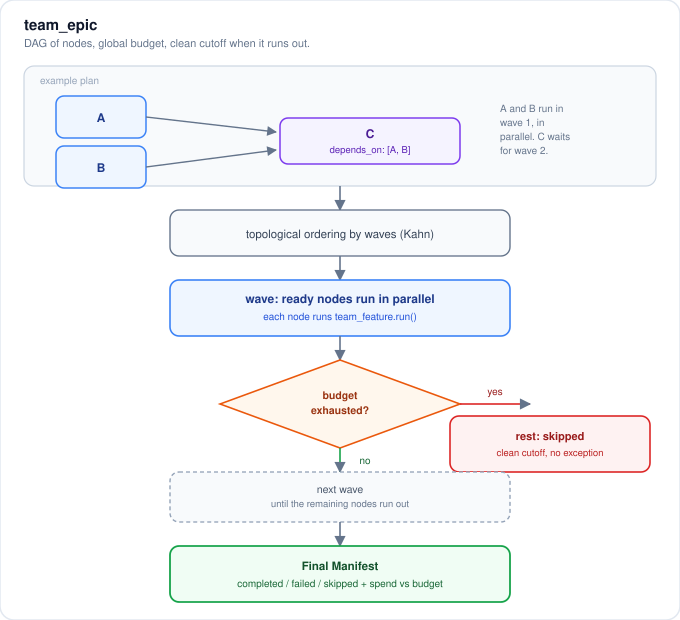
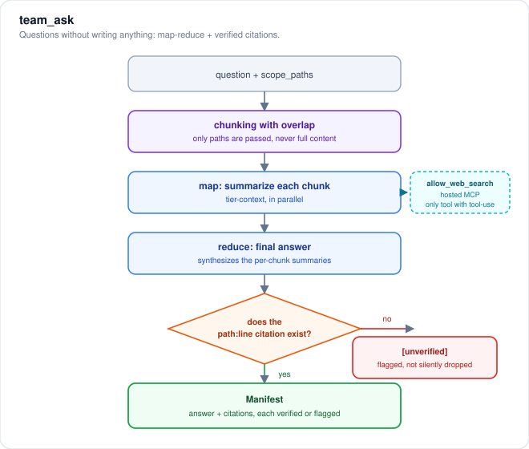
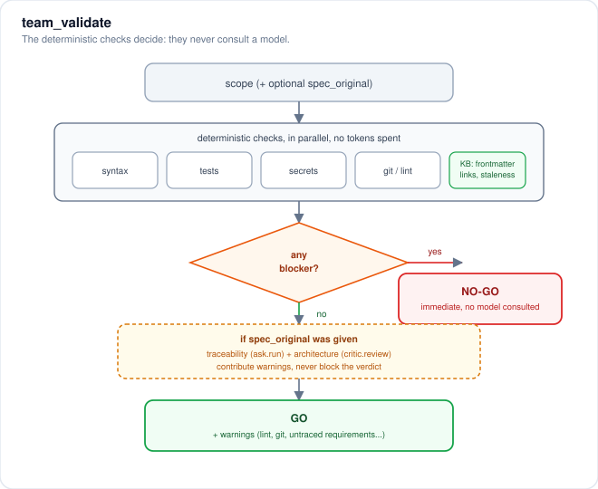
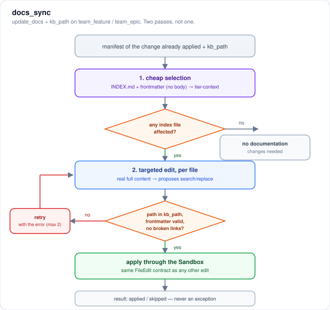

# Diagrams of the workflows

These are the internal pipelines behind the graduated tools of the `team`
MCP server (each with its own sub-agent, manifest, and isolated token
budget): `team_task`, `team_epic`, `team_ask`, `team_validate`, and
`docs_sync`. The general components and the `team_feature` pipeline are in
the Architecture section of the main README.

## team_task

`team_task` delegates a single edit to the `tier-coder` model, which
proposes exactly ONE edit in strict JSON. Before applying it, the edit is
tested in a scratch dir: if it fails, it's retried once with the literal
error fed back; if it still fails after those 2 attempts, the node is
marked `escalated_from=task` in the manifest instead of writing something
worse than promised (it never escalates itself silently).

## team_epic

`team_epic` takes a DAG of nodes (e.g. A and B independent, C depending on
both) and runs it in topological waves using Kahn's algorithm: nodes in
each wave run in parallel via `team_feature.run()`. Before each wave, the
token budget is checked, and if it's exhausted, the remaining nodes are
marked `skipped` with a clean cutoff (no exception). It ends by emitting a
manifest with `completed` / `failed` / `skipped` and the total spend.

## team_ask

`team_ask` chunks the question together with the given paths, always with
overlap and passing only paths (never full file content) to the
`tier-context` model, which summarizes each chunk in parallel (the `map`
phase); the summaries are then synthesized into a final answer (`reduce`).
Every `path:line` citation is verified deterministically against the
repository before the manifest is returned, and anything that can't be
verified is explicitly marked `[unverified]` instead of being silently
dropped. There's an optional branch: if `allow_web_search=True`, a hosted
web-search MCP server is enabled through LiteLLM's MCP Gateway (the only
one of the 5 tools that does live tool-use).

## team_validate

`team_validate` first runs, in parallel, every deterministic and free
check (syntax, tests, secrets, git, lint, and — if the scope is a
knowledge-base directory with `INDEX.md` — frontmatter, links, and
staleness too). Any deterministic blocker forces an immediate `NO-GO`
verdict WITHOUT consulting any model. Only if all of them pass and
`spec_original` was given are requirement traceability and an architecture
review added, which contribute warnings but never block the verdict.

## docs_sync

`docs_sync` is the documentation sub-agent, triggered by `update_docs=True`
and `kb_path` on `team_feature` / `team_epic`, and it runs in two passes.
The first is a cheap selection over the knowledge-base index: only
`INDEX.md` + each topic's frontmatter (no body) decides which files might
have gone stale because of the change. In the second, only for the
selected files, their real full content is read and a targeted edit is
proposed, with one retry if the edit doesn't match. Each edit is validated
deterministically (the path is inside `kb_path`, the resulting frontmatter
is still valid YAML, and no relative link ends up broken) before being
applied through the same Sandbox as any other edit. It only updates
entries that already exist in the index, never invents new files, and
never raises an exception even if everything fails.

See also the Architecture section in the main README for the general
components and the `team_feature` pipeline.
